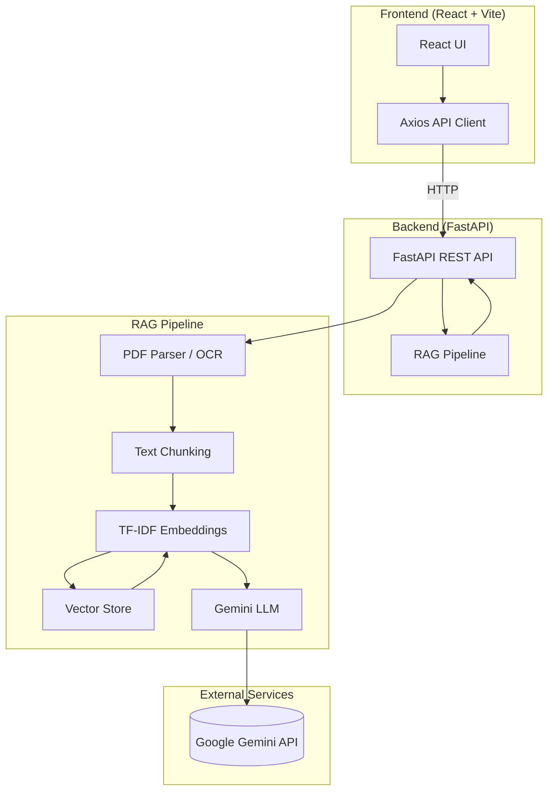
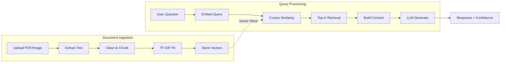
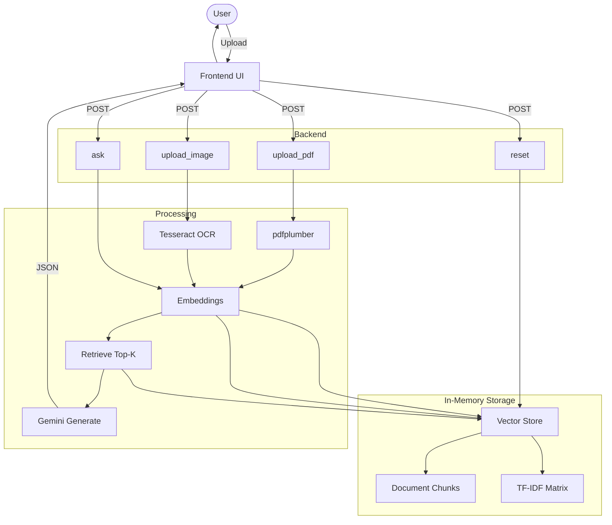
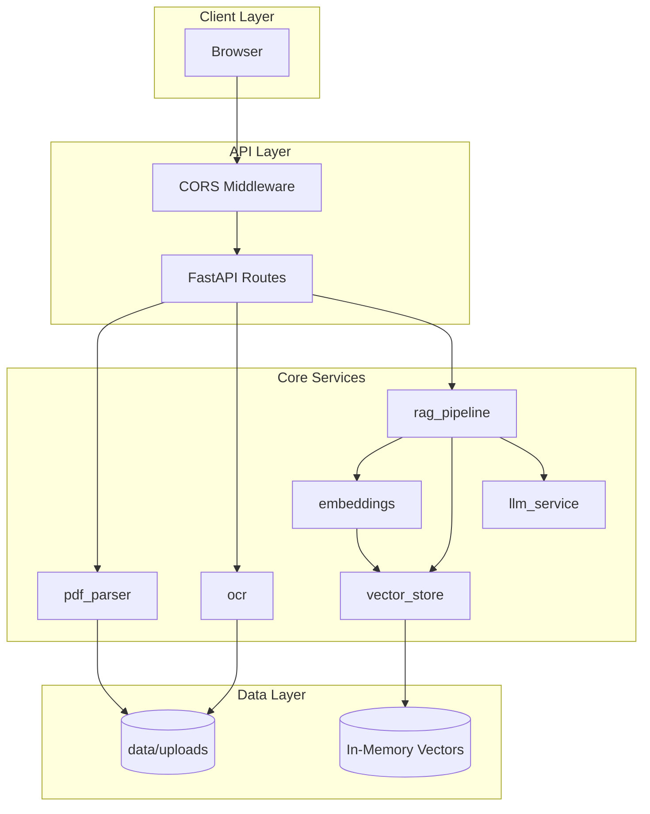
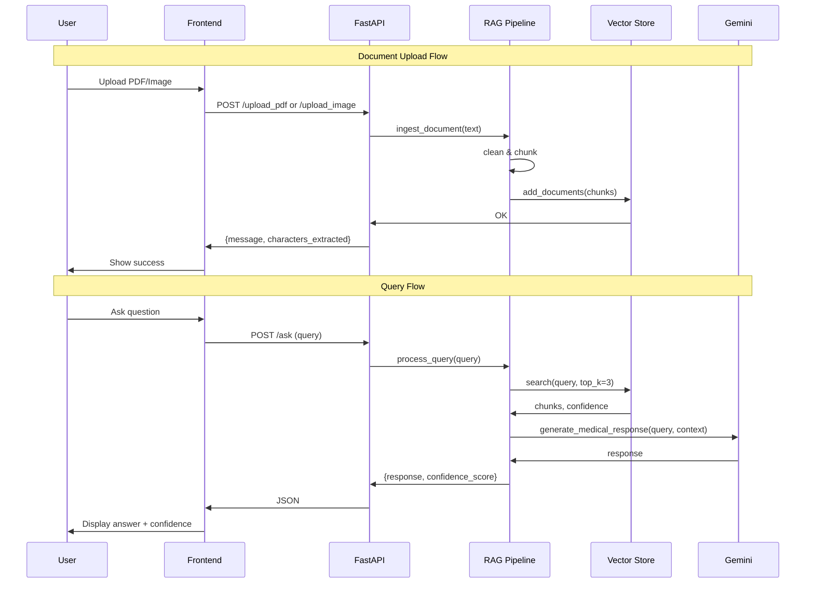

# Medical RAG Chatbot

> **RAG-powered medical document Q&A** — Upload PDFs or images, ask questions grounded in your documents. Built with Retrieval-Augmented Generation for accurate, context-aware medical insights with confidence scoring.

[](https://python.org)
[](https://fastapi.tiangolo.com)
[](https://react.dev)
[](https://vitejs.dev)

---

## Table of Contents

- [Features](#features)
- [System Architecture](#system-architecture)
- [RAG Pipeline Flow](#rag-pipeline-flow)
- [Data Flow Diagram](#data-flow-diagram)
- [API Sequence](#api-sequence)
- [Tech Stack](#tech-stack)
- [Project Structure](#project-structure)
- [Installation](#installation)
- [Usage](#usage)
- [API Reference](#api-reference)
- [Environment Variables](#environment-variables)

---

## Features

- **PDF ingestion** — Extract text from medical PDFs via pdfplumber
- **Image OCR** — Process scanned reports/images with Tesseract
- **RAG-based Q&A** — Retrieval-Augmented Generation for grounded answers
- **TF-IDF retrieval** — Fast semantic search with keyword boosting
- **Gemini LLM** — Google Gemini for response generation
- **Confidence scoring** — Similarity-based confidence for every answer
- **Summary mode** — "Summarize my report" for structured summaries

---

## System Architecture



---

## RAG Pipeline Flow



---

## Data Flow Diagram



---

## Component Interaction



---

## API Sequence



---

## Tech Stack

| Layer | Technology |
|-------|------------|
| **Frontend** | React 19, Vite 7, Tailwind CSS, Framer Motion, Lucide React, Axios |
| **Backend** | FastAPI, Uvicorn |
| **Embeddings** | scikit-learn TF-IDF |
| **Vector Store** | In-memory, cosine similarity |
| **LLM** | Google Gemini (`gemini-3-flash-preview`) |
| **PDF** | pdfplumber |
| **OCR** | Tesseract, Pillow |

---

## Project Structure

```
medical-rag-chatbot/
├── backend/
│   ├── main.py           # FastAPI app & REST endpoints
│   ├── rag_pipeline.py   # RAG orchestration (ingest, query)
│   ├── embeddings.py     # TF-IDF embeddings
│   ├── vector_store.py   # In-memory vector store
│   ├── llm_service.py    # Gemini LLM integration
│   ├── pdf_parser.py     # PDF text extraction
│   ├── ocr.py            # Image OCR (Tesseract)
│   ├── requirements.txt
│   ├── .env              # GEMINI_API_KEY (gitignored)
│   └── data/uploads/     # Uploaded files
└── frontend/
    ├── src/
    │   ├── App.jsx       # Main UI
    │   ├── api.js        # Backend API client
    │   └── components/
    ├── package.json
    └── vite.config.js
```

---

## Installation

### Prerequisites

- Python 3.10+
- Node.js 18+
- [Tesseract OCR](https://github.com/UB-Mannheim/tesseract/wiki) (for image uploads)
- Google Gemini API key

### Backend

```bash
cd backend
python -m venv venv

# Windows
.\venv\Scripts\activate

# macOS/Linux
source venv/bin/activate

pip install -r requirements.txt
```

### Frontend

```bash
cd frontend
npm install
```

---

## Usage

### 1. Set environment variables

Create `backend/.env`:

```env
GEMINI_API_KEY=your_api_key_here
```

### 2. Run backend

```bash
cd backend
.\venv\Scripts\activate   # Windows
uvicorn main:app --reload --host 127.0.0.1 --port 8000
```

### 3. Run frontend

```bash
cd frontend
npm run dev
```

### 4. Open the app

- Frontend: http://localhost:5173
- API docs: http://127.0.0.1:8000/docs

---

## API Reference

| Method | Endpoint | Description |
|--------|----------|-------------|
| `GET` | `/` | Health check |
| `POST` | `/upload_pdf` | Upload PDF, extract text, ingest into RAG |
| `POST` | `/upload_image` | Upload image, OCR, ingest |
| `POST` | `/ask` | Ask a question (form: `query`) |
| `POST` | `/reset` | Clear vector store and reset documents |

---

## Environment Variables

| Variable | Required | Description |
|----------|----------|-------------|
| `GEMINI_API_KEY` | Yes | Google Gemini API key for LLM |

---

## License

MIT
